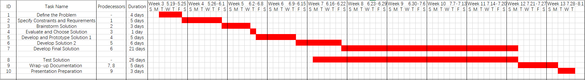

# ENSE 375 – Software Testing and Validation

# Interactive Quiz System

## Team Members:
- Trupalkumar Dharmeshbhai Ukani (200515399)
- Bhargav Taraviya (200518969)
- Yi Xu (200457644)

## Table of Contents

[1 Introduction](#_Toc43885122)

[2 Design Problem](#_Toc43885123)

[2.1 Problem Definition](#_Toc43885124)

[2.2 Design Requirements](#_Toc43885125)

[2.2.1 Functions](#_Toc43885126)

[2.2.2 Objectives](#_Toc43885127)

[2.2.3 Constraints](#_Toc43885128)

[3 Solution](#_Toc43885129)

[3.1 Solution 1](#_Toc43885130)

[3.2 Solution 2](#_Toc43885131)

[3.3 Final Solution](#_Toc43885132)

[3.3.1 Components](#_Toc43885133)

[3.3.2 Features](#_Toc43885134)

[3.3.3 Environmental, Societal, Safety, and Economic Considerations](#_Toc43885135)

[3.3.4 Test cases and results](#_Toc43885136)

[3.3.5 Limitations](#_Toc43885137)

[4 Team Work](#_Toc43885138)

[4.1 Meeting 1](#_Toc43885139)

[4.2 Meeting 2](#_Toc43885140)

[4.3 Meeting 3](#_Toc43885141)

[4.4 Meeting 4](#_Toc43885142)

[5 Project Management](#_Toc43885143)

[6 Conclusion and Future Work ](#_Toc43885144)

[7 References](#_Toc43885145)

[8 Appendix](#_Toc43885146)

## List of Figures

## List of Tables

# **1 &nbsp;Introduction**
- This project focuses on designing and developing the Interactive Quiz System, a Java-based application for creating and managing quizzes. Our goal is to simplify the process of quiz administration so users can take and manage quizzes easily. Since traditional paper quizzes are time-consuming for feedback, and hard to save for long time, we are motivated to provide this quiz system for effective quiz management that benefits users. 
- The following sections will cover problem definition, design requirements and solutions. Finally, there is a conclusion and ideas for future work.

# **2 &nbsp;Design Problem**
## 2.1 &nbsp;Problem Definition
### **Problems for Ineffective Quiz Management:**

**1. Inconvenience:** Traditional paper-based quizzes require significant time and efforts for distribution and evaluation. \
**2. Limited Accessibility:** Traditional methods do not support easy access and management of quizzes from remote locations, which can be lost somewhere easily. \
**3. Complexity of Existing Solutions:** Many existing digital solutions are overly complex and not user-friendly. 

### **Benefits of an Digital Solution:** 

**1. Improved Efficiency:** A digital system can automate quiz creation, distribution, and evaluation, saving time and effort. \
**2. User-Friendly Interface:** A straightforward interface makes it easier for users to manage quizzes. \
**3. Remote Accessibility:** Users can access and manage quizzes from any location, facilitating remote learning. 

### **Rationale** 

It was evident that there is a need for this project through the various issues related to the difficulties of using traditional approaches, as well as managing digital quiz packages and tools that are currently available. A wide range of users will benefit from improved management of quizzes provided by the Interactive Quiz System, which focuses on a simple, efficient, and accessible service. Our system avoids the major drawbacks of purely paper-based systems and complex electronic systems. It maintains the productivity of a system without some redundant features.

## 2.2 &nbsp;Design Requirements
### 2.2.1 Functions
The Interactive Quiz System provides the following key functions: 

- **Create Quiz**: Users can create new quizzes by adding various types of questions. 
- **Edit Quiz**: Users can modify existing quizzes, including updating quiz name and questions. 
- **Delete Quiz**: Users can remove existing quizzes from the system. 
- **Add Question**: Users can add new questions to quizzes, with different question types such as multiple choice and true/false. 
- **Edit Question**: Users can update the content of existing questions in the quiz. 
- **Take Quiz**: Users can participate in quizzes. The questions will be presented and answers chosen by users will be recorded. 
- **Score Quiz**: Automatically calculate and display score immediately after finishing the quiz, providing immediate feedback on performance.
### 2.2.2 Objectives
The design of the Interactive Quiz System aims to achieve the following objectives: 

- **User-Friendly**: The system should provide an intuitive and easy-to-navigate interface to improve user interaction and satisfaction. 
- **Efficient**: The system should ensure a smooth and seamless user experience without causing errors. 
- **Responsive**: The system should offer real-time scoring and immediate feedback upon quiz completion. 
- **Reliable**: The system should function correctly and consistently under normal usage conditions, maintaining data integrity and accuracy. 
- **Maintainable**: The system should be designed with clean and modular code, facilitating easy maintenance and future enhancements. 
- **Secure**: The system should store user data and quiz content securely to prevent unauthorized access and ensure data privacy. 
### 2.2.3 Constraints
The Interactive Quiz System will consider the following constraints: 

- **Economic factors:**  Since there is no budgets for this project, we will keep this project in a small size.
- **Regulatory compliance**: Users are required to sign in to the system for using the service, and we will prevent personal account information from leaking.
- **Reliability**: The quiz system can be maintained to ensure an excellent user experience
- **Ethics**: The grading criteria for the quizzes are equal for all users.

# **3 &nbsp;Solution**

## 3.1 &nbsp;Solution 1

Our initial solution was to implement the Interactive Quiz System using a basic structure focusing on essential functionalities. The primary features included a login system, adding quizzes, deleting quizzes, and viewing all quizzes. We aimed to build a foundation before adding more complex features. 

**Reason for Not Selecting This Solution** 

This approach had significant drawbacks. The application only supported adding quizzes without the ability to add questions and answers, making the system incomplete. Managing multiple users and quizzes through a CLI was unmanageable. Given these limitations, we decided that this solution would not be suitable for our project goals and needed further enhancement.

**Summary of Available Features**
- Login System: Basic user authentication to secure access.
- Add Quiz: Users can add quizzes to the system.
- Delete Quiz: Users can delete existing quizzes.
- View All Quizzes: Users can list all available quizzes.

## 3.2 &nbsp;Solution 2
For the second solution, the login system will identify admins and regular users. More basic functionalities are added based on the first solution by introducing additional features to create, edit, delete and manage quizzes with a structured approach. This version included the use of several classes to handle different parts of the quiz system which made the code more readable and easier to maintain.

**Reason for Not Selecting This Solution** 

While this solution was a good improvement over Solution 1, it still had some limitations. Without the input validations for the account system and quiz system, there could be many potential risks, leading to poor user experience. 

**Summary of Available Features**
- Login System: Authentication is supported for identifying admin and regular users.
-	Create Quiz: Admins can create quizzes with multiple questions, improving the method of the first solution.
-	Edit Quiz: Admins can edit existing quizzes, including quiz titles and questions.
-	Delete Quiz: Admins can also delete quizzes.
-	View All Quizzes: Both admins and regular users can view all the available quizzes, with detailed information on questions and options.
-	Take Quiz: Users can take quizzes and receive immediate scores, improving feedback system.
-	Add User: Admins can add new users which supports better user management.

## 3.3 &nbsp;Final Solution
In the final solution, the validations for username and password are implemented. For quiz creation, admins will see error messages if any issues exist. The final solution contains all basic functionalities needed for an online quiz system. The table below shows the comparision among solutions of different versions. 
| Functionalities/Solutions | Solution 1 | Solution 2 | Final Solution |
|:-------------------------:|:----------:|:----------:|:--------------:|
|        Login System       |      ✓     |      ✓     |        ✓       |
| Admin and User Separation |            |      ✓     |        ✓       |
|       Quiz Creation       |      ✓     |      ✓     |        ✓       |
|       Quiz Deletion       |      ✓     |      ✓     |        ✓       |
|       Quiz Execution      |            |      ✓     |        ✓       |
|        Quiz Edition       |            |      ✓     |        ✓       |
|      Input Validation     |            |            |        ✓       |
### 3.3.1 Components
In our solution, the components include Authentication system, Admins, Users, User Management, Quiz Management, Question Management and Quiz Execution. 

### 3.3.2 Features
- User Authentication: While logging in, show different menus for admins and users
- Add new user： Admins can add users by providing username and password that can pass the validation
- View all quizzes: Admins can view the quizzes they have made in the admin menu

### 3.3.3 Environmental, Societal, Safety, and Economic Considerations
- Environmental Consideration: The online quiz system saves paper, and it will save a lot resources for long-term usage. 
- Societal Consideration: For professors, the online quiz system saves the time of collecting and distributing the quiz papers
- Safety Consideration: With login system and password validation, the safety of the account can be ensured
- Economic Consideration: As the time is not sufficient for a large-sized prpject, we keep this project small with all functionalities needed
### 3.3.4 Test cases and results
For AddUser function, we use Boundry Value Testing, Decision Tables Testing and Equivalence Class Testing.  
For TakeQuiz function, we choose Use Case Testing. 
The Unit Testing and Integration Testing are also implemented. 
Detailed information about testing are provided in [TESTING.md](TESTING.md) file. 
### 3.3.5 Limitations
- Lack of User Review: Users can not review the results of the quizzes they have taken before
- Weak User feedback: Users got an instant feedback which shows the mark they got, but they don't know the specific questions are right or wrong
# **4 &nbsp;Team Work**

## 4.1 &nbsp;Meeting 1

Time: Month Date, Year, hour: minutes am/pm to hour: minutes am/pm  
Agenda:
| Team Member                    | Previous Task | Completion State | Next Task |
|--------------------------------|---------------|------------------|-----------|
| Trupalkumar Dharmeshbhai Ukani |               |                  |           |
| Bhargav Taraviya               |               |                  |           |
| Yi Xu                          |               |                  |           |

## 4.2 &nbsp;Meeting 2

Time:  
Agenda:
| Team Member                    | Previous Task | Completion State | Next Task |
|--------------------------------|---------------|------------------|-----------|
| Trupalkumar Dharmeshbhai Ukani |               |                  |           |
| Bhargav Taraviya               |               |                  |           |
| Yi Xu                          |               |                  |           |

## 4.3 &nbsp;Meeting 3

Time:  
Agenda:
| Team Member                    | Previous Task | Completion State | Next Task |
|--------------------------------|---------------|------------------|-----------|
| Trupalkumar Dharmeshbhai Ukani |               |                  |           |
| Bhargav Taraviya               |               |                  |           |
| Yi Xu                          |               |                  |           |

## 4.4 &nbsp;Meeting 4

Time:  
Agenda:
| Team Member                    | Previous Task | Completion State | Next Task |
|--------------------------------|---------------|------------------|-----------|
| Trupalkumar Dharmeshbhai Ukani |               |                  |           |
| Bhargav Taraviya               |               |                  |           |
| Yi Xu                          |               |                  |           |

# **5 &nbsp;Project Management**

* Weekends are excluded from the schedule.
* Testing is integrated throughout the coding process.
# **6 &nbsp;Conclusion and Future Work**

# **7 &nbsp;References**

# **8 &nbsp;Appendix**

